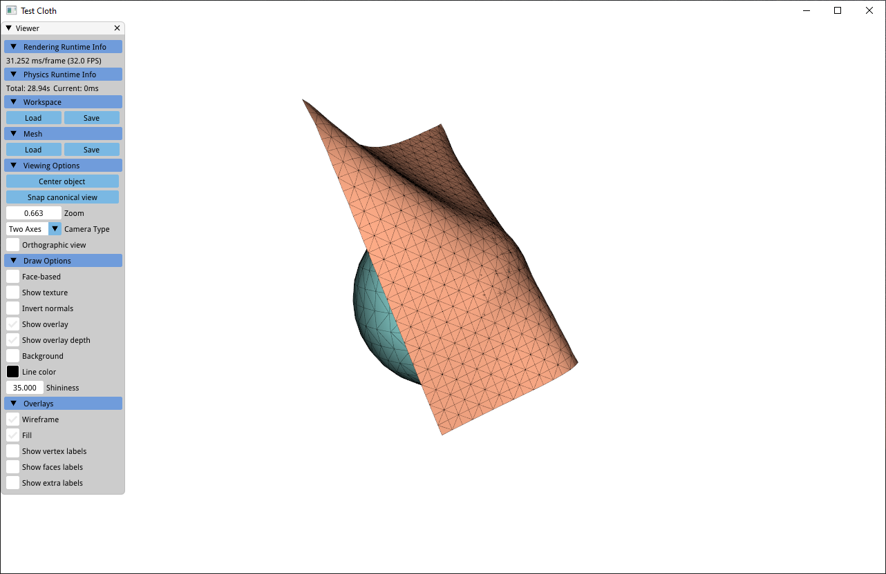
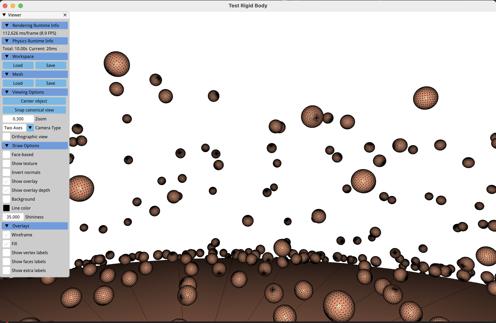

# PositionBasedDynamics

## Introduction

[PositionBasedDynamics](https://github.com/BFU-Graphics/PositionBasedDynamics) is a basic simulation framework to facilitate developing [" Position Based Dynamics "](https://matthias-research.github.io/pages/publications/posBasedDyn.pdf) based projects from scratch.

1. PositionBasedDynamics need no external dependencies but self-contained [libigl](https://github.com/libigl/libigl), which is a simple C++ geometry processing library, and would be automacally included once build.
2. PositionBasedDynamics seperates utterlly the rendering part and the simulation part while developing.

## Build Instruction

**For all platforms:**

1. Clone [PositionBasedDynamics](https://github.com/BFU-Graphics/PositionBasedDynamics), or simply download this repo.
2. cmake, and build

## Gallery

### Deformable Material

### Rigid Body Dynamics

### Fluid Dynamics

comming soon

## Feature

### Cloth

- [x] distance constraint
- [x] dihedral constraint
- [ ] penetration constraint

### Rigid Body

- [x] global BVH collision detection
- [x] rigid-rigid contact constraint